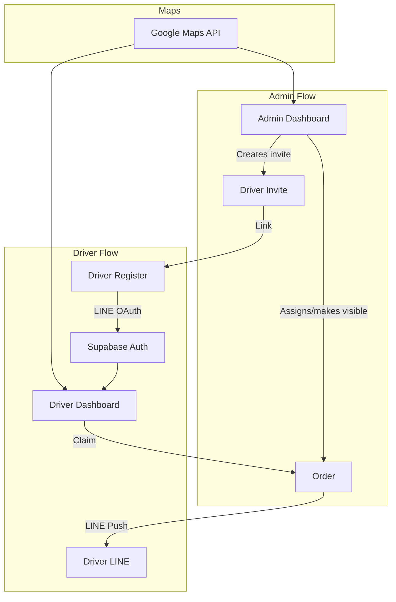
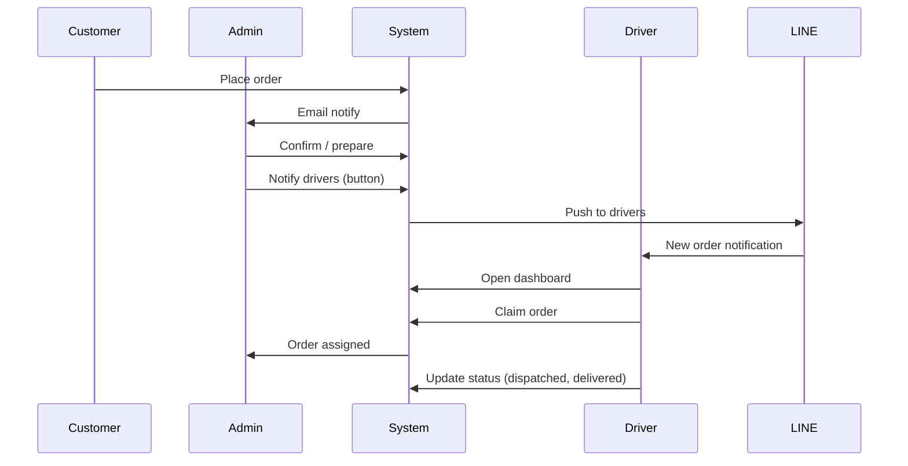

# Flower Delivery Driver Platform Implementation Plan

## Architecture Overview




---

## 1. Database Schema (Supabase)

### 1.1 `driver_invites` table

Invite-only registration. Admin creates invite, driver registers via link.

```sql
CREATE TABLE public.driver_invites (
  id uuid PRIMARY KEY DEFAULT gen_random_uuid(),
  email text NOT NULL,
  phone text NOT NULL,
  invite_token text UNIQUE NOT NULL,
  expires_at timestamptz NOT NULL,
  used_at timestamptz,
  created_by_admin_id uuid REFERENCES admin_users(id),
  created_at timestamptz DEFAULT now()
);
CREATE INDEX idx_driver_invites_token ON public.driver_invites(invite_token);
CREATE INDEX idx_driver_invites_email ON public.driver_invites(email);
```

### 1.2 `drivers` table

Stores driver profile; auth handled by Supabase Auth (separate `auth.users`).

```sql
CREATE TABLE public.drivers (
  id uuid PRIMARY KEY DEFAULT gen_random_uuid(),
  supabase_user_id uuid UNIQUE NOT NULL REFERENCES auth.users(id),
  email text NOT NULL,
  name text NOT NULL,
  phone text NOT NULL,
  line_user_id text,
  invite_id uuid REFERENCES driver_invites(id),
  is_active boolean NOT NULL DEFAULT true,
  created_at timestamptz DEFAULT now(),
  updated_at timestamptz DEFAULT now()
);
CREATE INDEX idx_drivers_supabase_user ON public.drivers(supabase_user_id);
CREATE INDEX idx_drivers_line_user ON public.drivers(line_user_id);
```

### 1.3 `orders` table changes

Add `driver_id` FK and keep `driver_name`, `driver_phone` for display.

```sql
ALTER TABLE public.orders ADD COLUMN IF NOT EXISTS driver_id uuid REFERENCES public.drivers(id);
CREATE INDEX idx_orders_driver_id ON public.orders(driver_id);
```

### 1.4 Row Level Security (RLS)

- `drivers`: Drivers see only their own row.
- `orders`: Drivers see orders where `driver_id = auth.uid()` or `driver_id IS NULL` and `payment_status = 'PAID'` (available orders).
- `driver_invites`: Drivers can read by `invite_token` during registration.

---

## 2. Auth Strategy: Supabase Auth for Drivers

- **Admin**: Keep existing NextAuth + `admin_users` (unchanged).
- **Drivers**: Use Supabase Auth with **LINE as OAuth provider**.

### 2.1 Supabase Auth + LINE

- In Supabase Dashboard: Authentication → Providers → LINE (enable, add LINE Channel credentials).
- LINE Channel: Create a **LINE Login** channel at [LINE Developers Console](https://developers.line.biz/console/). For push notifications, use a channel that supports both Login and Messaging API, or a separate Messaging API channel.

### 2.2 Driver registration flow

1. Admin creates invite at `/admin/drivers` → inserts `driver_invites` with `invite_token`.
2. Admin sends invite link: `{APP_URL}/driver/register?token={invite_token}`.
3. Driver opens link → form pre-fills email/phone from invite (or validates against invite).
4. Driver clicks "Sign up with LINE" → Supabase `signInWithOAuth({ provider: 'line' })`.
5. After LINE OAuth callback, Supabase creates `auth.users` row.
6. Server creates `drivers` row with `supabase_user_id`, `line_user_id` (from LINE profile), and marks `driver_invites.used_at`.

### 2.3 Driver login flow

- Driver goes to `/driver/login` → "Login with LINE" → Supabase `signInWithOAuth({ provider: 'line' })`.
- Session stored in Supabase client (cookie/localStorage).

### 2.4 Middleware

- Protect `/driver/*` except `/driver/login`, `/driver/register`, `/driver/register/callback`.
- Check Supabase session for driver routes (use `createServerClient` from `@supabase/ssr` to read session in middleware).

---

## 3. Google Maps API Integration

### 3.1 Scope

- **Driver dashboard**: Map of available/assigned orders with markers, directions.
- **Admin order detail**: Optional embedded map (currently uses `delivery_google_maps_url` link).
- **Customer cart**: Optional upgrade of [DeliveryLocationPicker.tsx](components/DeliveryLocationPicker.tsx) from Leaflet/OSM to Google Maps (address autocomplete, better UX).

### 3.2 Implementation

- Add `@react-google-maps/api` or `@vis.gl/react-google-maps`.
- Env: `NEXT_PUBLIC_GOOGLE_MAPS_API_KEY`.
- Google Cloud: Enable Maps JavaScript API, Places API (for autocomplete), Directions API (for driver navigation).
- Keep Leaflet for now if scope is driver-only; migrate DeliveryLocationPicker in a later phase if desired.

### 3.3 Driver map features

- List available orders with delivery pins.
- Click order → show address, recipient, "Accept" button.
- After accept → show route to delivery (Directions API) and "Open in Google Maps" link.

---

## 4. LINE Notifications for Drivers

### 4.1 Channel setup

- Create **LINE Messaging API** channel (or use one that supports both Login + Messaging).
- Driver must add the bot as friend to receive push messages.
- Store `line_user_id` in `drivers` when they complete LINE OAuth (from Supabase/LINE profile).

### 4.2 Push notification flow

When a new paid order becomes available (or admin marks it for drivers):

1. API route or server action triggered (e.g. on order status change or explicit "Notify drivers" from admin).
2. Fetch all active drivers with `line_user_id`.
3. Call LINE Messaging API: `POST https://api.line.me/v2/bot/message/push` with `userId` and message payload.
4. Message: e.g. "New delivery: Order LB-2026-xxxx, {address}, {time}. Open app to accept."

### 4.3 Server-side helper

- New file: `lib/lineDriverNotify.ts`.
- Env: `LINE_CHANNEL_ACCESS_TOKEN` (Messaging API channel).
- Function: `notifyDriversOfNewOrder(orderId, address, timeSlot)`.

---

## 5. Admin Dashboard Extensions

### 5.1 Driver management (`/admin/drivers`)

- List drivers (from `drivers` table).
- **Create invite**: Form (email, phone) → insert `driver_invites`, copy invite link.
- List invites (pending, used, expired).
- Deactivate driver (`is_active = false`).

### 5.2 Order assignment

- On [order detail page](app/admin/(dashboard)/orders/[order_id]/page.tsx):
  - Add "Notify drivers" button → calls `notifyDriversOfNewOrder`.
  - Add "Assign to driver" dropdown (approved drivers) → set `driver_id`, `driver_name`, `driver_phone`.
- Orders with `driver_id IS NULL` and `payment_status = 'PAID'` are "available" for drivers to claim.

---

## 6. Driver Dashboard

### 6.1 Routes


| Route                      | Purpose                                    |
| -------------------------- | ------------------------------------------ |
| `/driver`                  | Redirect to dashboard or login             |
| `/driver/login`            | LINE OAuth login                           |
| `/driver/register`         | Invite-based registration (token required) |
| `/driver/dashboard`        | Available + assigned orders, map           |
| `/driver/orders/[orderId]` | Order detail, accept, status update        |


### 6.2 APIs


| Endpoint                              | Method | Purpose                                                                           |
| ------------------------------------- | ------ | --------------------------------------------------------------------------------- |
| `/api/driver/orders/available`        | GET    | List orders: `payment_status=PAID`, `driver_id IS NULL`, `delivery_date >= today` |
| `/api/driver/orders/assigned`         | GET    | Orders where `driver_id = current_driver`                                         |
| `/api/driver/orders/[orderId]/claim`  | POST   | Set `driver_id`, update `driver_name`/`driver_phone`, optionally notify admin     |
| `/api/driver/orders/[orderId]/status` | PATCH  | Update `fulfillment_status` (e.g. dispatched, delivered)                          |


### 6.3 Real-time (optional)

- Supabase Realtime on `orders` table: subscribe to INSERT/UPDATE where `driver_id IS NULL` and `payment_status = 'PAID'` to refresh available list without polling.
- LINE push remains primary notification channel.

---

## 7. Order Flow Summary




---

## 8. File Changes Summary

### New files


| Path                                               | Purpose                                              |
| -------------------------------------------------- | ---------------------------------------------------- |
| `supabase/migrations/YYYYMMDD_driver_platform.sql` | `driver_invites`, `drivers`, `orders.driver_id`, RLS |
| `app/driver/login/page.tsx`                        | Driver login (LINE OAuth)                            |
| `app/driver/register/page.tsx`                     | Invite-based registration                            |
| `app/driver/dashboard/page.tsx`                    | Available + assigned orders, map                     |
| `app/driver/orders/[orderId]/page.tsx`             | Order detail, claim, status                          |
| `app/driver/layout.tsx`                            | Driver layout, Supabase provider                     |
| `app/api/driver/orders/available/route.ts`         | GET available orders                                 |
| `app/api/driver/orders/assigned/route.ts`          | GET assigned orders                                  |
| `app/api/driver/orders/[orderId]/claim/route.ts`   | POST claim order                                     |
| `app/api/driver/orders/[orderId]/status/route.ts`  | PATCH fulfillment status                             |
| `app/api/admin/drivers/invites/route.ts`           | POST create invite                                   |
| `app/admin/(dashboard)/drivers/page.tsx`           | Driver management, invites                           |
| `lib/lineDriverNotify.ts`                          | LINE push to drivers                                 |
| `lib/supabase/client.ts`                           | Browser Supabase client for drivers                  |
| `lib/supabase/middleware.ts`                       | Session refresh for driver routes                    |


### Modified files


| Path                                                                                                 | Changes                                                    |
| ---------------------------------------------------------------------------------------------------- | ---------------------------------------------------------- |
| [middleware.ts](middleware.ts)                                                                       | Add `/driver/*` protection, Supabase session check         |
| [app/admin/(dashboard)/orders/[order_id]/page.tsx](app/admin/(dashboard)/orders/[order_id]/page.tsx) | Driver selector, "Notify drivers" button                   |
| [lib/supabase/adminQueries.ts](lib/supabase/adminQueries.ts)                                         | Add `driver_id` to types, driver queries                   |
| [package.json](package.json)                                                                         | Add `@supabase/ssr`, `@react-google-maps/api` (or similar) |


---

## 9. Environment Variables


| Variable                          | Purpose                                 |
| --------------------------------- | --------------------------------------- |
| `NEXT_PUBLIC_SUPABASE_URL`        | Supabase project URL                    |
| `NEXT_PUBLIC_SUPABASE_ANON_KEY`   | Supabase anon key (driver client)       |
| `SUPABASE_SERVICE_ROLE_KEY`       | Already used for admin                  |
| `LINE_CHANNEL_ACCESS_TOKEN`       | Messaging API channel (push to drivers) |
| `NEXT_PUBLIC_GOOGLE_MAPS_API_KEY` | Google Maps for driver dashboard        |


Supabase Auth LINE provider configured in Supabase Dashboard (LINE Channel ID + Secret).

---

## 10. Implementation Phases

**Phase 1 – Foundation**

- Migration: `driver_invites`, `drivers`, `orders.driver_id`, RLS
- Supabase Auth: Enable LINE provider
- Driver invite creation in admin
- Driver registration + login (LINE OAuth)

**Phase 2 – Driver dashboard**

- `/driver/dashboard` with available/assigned orders
- Claim order API
- Basic order detail page (no map yet)

**Phase 3 – Maps**

- Google Maps API setup
- Map on driver dashboard with order pins
- Directions / "Open in Google Maps" for accepted orders

**Phase 4 – Notifications**

- `lib/lineDriverNotify.ts`
- "Notify drivers" in admin order detail
- Optional: trigger on new paid order (webhook/cron)

**Phase 5 – Polish**

- Admin driver management UI
- Status update from driver (dispatched, delivered)
- Supabase Realtime for live order list (optional)

