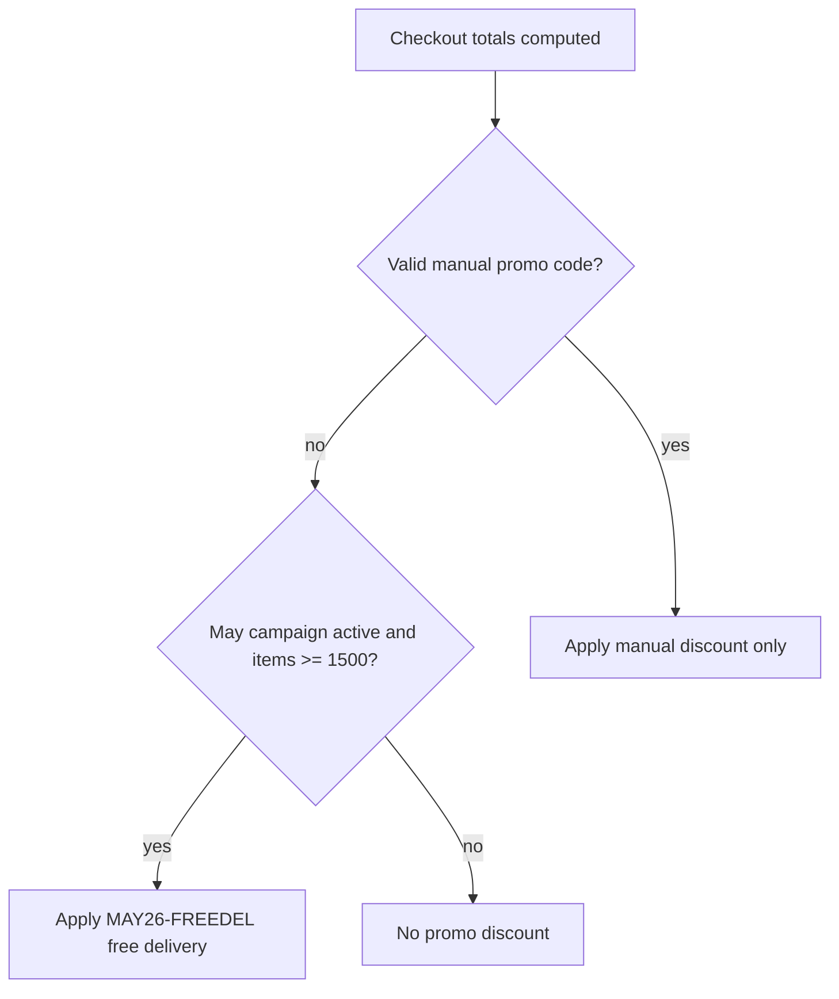

# May 2026 automatic free-delivery promotion

## Goal

From **19 May through 31 May 2026** (shop timezone `Asia/Bangkok`), customers get **free delivery automatically** when **product subtotal ≥ ฿1,500** (items only, before delivery fee). No promo code entry.

**Cannot be combined with any other offer** (manual promo codes, welcome codes, happy-hour code, etc.).

## Assets

| Asset | Path | Spec |
|-------|------|------|
| Site banner (provided) | [`public/promo_banner/Free_delivery_May_2026.png`](public/promo_banner/Free_delivery_May_2026.png) | 2172 × 724 px, **3:1** |

Optional later (not required for v1): a mobile-cropped PNG (e.g. 1080 × 1080 or 1080 × 1350) at `public/promo_banner/Free_delivery_May_2026_mobile.png` for sharper mobile crops via `<picture>`.

## How promotions work today

- Discounts live in [`lib/referral.ts`](lib/referral.ts) as an allowlisted code map (`DISCOUNT_CODES`).
- Cart stores an optional manual code in `localStorage`; checkout sends `referralCode` when a code applies.
- **Server is authoritative**: [`app/api/stripe/create-checkout-session/route.ts`](app/api/stripe/create-checkout-session/route.ts) recomputes discount and rejects invalid codes.
- Site chrome today: slim text [`PrimeHourPromoBanner`](components/PrimeHourPromoBanner.tsx) fixed under the safe area (~2.25rem tall).

There is **no** existing auto-threshold or date-window logic—this needs a campaign layer plus a new **image** promo strip.

## Exclusive stacking rule

- **If the customer has a valid manual/welcome promo code** → use **only** that discount; **do not** apply the May free-delivery campaign (even if they would qualify).
- **If no valid manual code** → apply May free delivery when eligible.
- **Never stack** two discounts on one order.

**Cart UX when both could apply:**

- During the campaign window, if the user applies another code via [`ReferralCodeBox`](components/ReferralCodeBox.tsx), show a short message (EN/TH): e.g. “This offer cannot be combined with other promotions. Remove your code to use free delivery, or keep your code instead.”
- Order summary shows **either** the referral discount **or** the May free-delivery line—not both.
- Server must enforce the same rule so a client cannot send both.

## Architecture (discount resolution)

**`resolveOrderDiscount`** (new, shared): given `itemsTotal`, `deliveryFee`, optional `referralCode`, `now`:

1. If `referralCode` is present and resolves to a positive discount (including welcome-code path on server) → return manual result only.
2. Else if May campaign active and `itemsTotal >= 1500` → return `{ code: 'MAY26-FREEDEL', discount, allocation: 'delivery', source: 'campaign' }`.
3. Else → no discount.

Tracking code **`MAY26-FREEDEL`** on orders for [`supabase/queries/promotion_expense_report.sql`](supabase/queries/promotion_expense_report.sql). Register in `DISCOUNT_CODES` as `{ type: 'free_delivery' }` for allocation helpers.

Date check: `shopTodayYmd()` from [`lib/shopTime.ts`](lib/shopTime.ts) between `2026-05-19` and `2026-05-31` inclusive (Bangkok).

## Site banner (image, responsive)

**Component:** [`components/MayFreeDeliveryPromoBanner.tsx`](components/MayFreeDeliveryPromoBanner.tsx) (new)

- Shown only when `isMay2026FreeDeliveryActive()` is true.
- Fixed below safe area (same z-index band as prime-hour banner, `z-[60]`).
- Uses `next/image` with `src="/promo_banner/Free_delivery_May_2026.png"`, `alt` from i18n (EN/TH: free delivery May promo).
- **Desktop (md+):** full-width strip with **`aspect-ratio: 3 / 1`** (matches 2172×724).
- **Mobile (< md):** same asset in **`aspect-ratio: 1 / 1`** with `object-fit: cover`, `object-position: center`.
- One PNG is enough; second mobile file is optional.

**Chrome layout:** [`components/MainSiteChrome.tsx`](components/MainSiteChrome.tsx) — mount banner + dynamic padding for header/main.

## Files to change

| File | Change |
|------|--------|
| [`lib/promo/campaigns.ts`](lib/promo/campaigns.ts) | **New** |
| [`lib/promo/resolveOrderDiscount.ts`](lib/promo/resolveOrderDiscount.ts) | **New** |
| [`lib/referral.ts`](lib/referral.ts) | `MAY26-FREEDEL` |
| [`app/api/stripe/create-checkout-session/route.ts`](app/api/stripe/create-checkout-session/route.ts) | Exclusive resolver |
| [`lib/checkout/buildStripeCheckoutSessionBody.ts`](lib/checkout/buildStripeCheckoutSessionBody.ts) | Resolver |
| [`app/[lang]/cart/CartPageClient.tsx`](app/[lang]/cart/CartPageClient.tsx) | Cart UX |
| [`components/ReferralCodeBox.tsx`](components/ReferralCodeBox.tsx) | Cannot-combine hint |
| [`components/MayFreeDeliveryPromoBanner.tsx`](components/MayFreeDeliveryPromoBanner.tsx) | **New** |
| [`components/MainSiteChrome.tsx`](components/MainSiteChrome.tsx) | Mount banner |
| [`lib/i18n.ts`](lib/i18n.ts) | EN + TH strings |

## Verification checklist

1. Banner visible 19–31 May; hidden 1 Jun; OK on mobile + desktop.
2. Cart ≥ ฿1,500 → free delivery, no code.
3. Other promo code → no May free delivery.
4. Stripe total matches cart; `referral_code = MAY26-FREEDEL` for campaign orders.
