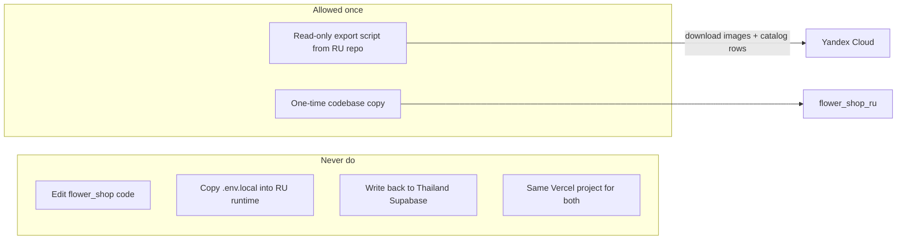
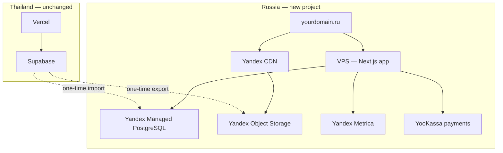
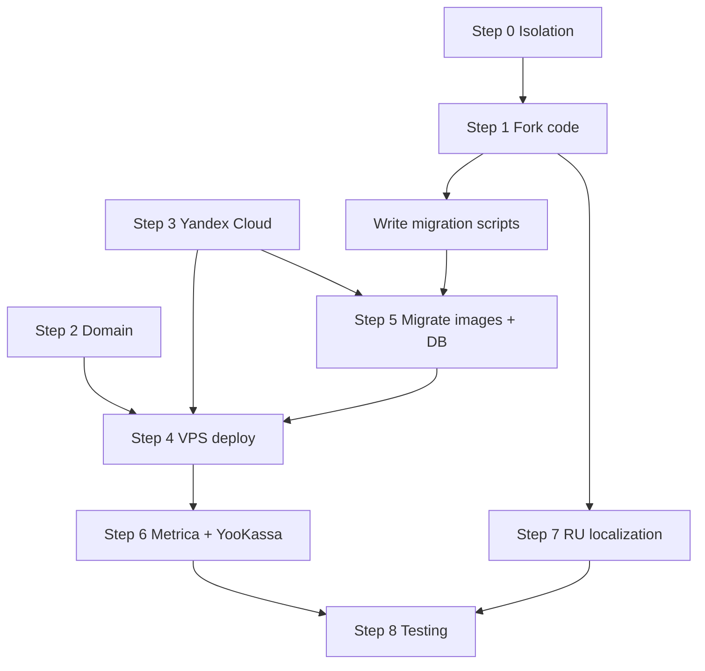

# Russia storefront migration — your 8-step plan (refined)

This plan follows **your sequence**. Thailand site (`lannabloom.shop`) stays on **Vercel + Supabase** unchanged.

**Golden rule:** all Russia work happens in a **separate folder/repo**. We **never edit** [`flower_shop/`](/Users/bi/Desktop/Cursor/flower_shop) after the initial copy. No shared deploy, no shared `.env`, no dual-write.

---

## Step 0 — Project isolation (do this first)

### Folder & repo boundaries

| Action | Why |
|--------|-----|
| Create **sibling** folder, e.g. `/Users/bi/Desktop/Cursor/flower_shop_ru/` — **not** inside `flower_shop/` | Prevents accidental commits/deploys to Thailand |
| `cp -R flower_shop flower_shop_ru` then `rm -rf flower_shop_ru/.git` and `git init` (new repo) | Clean history; no link to Lanna Bloom Vercel project |
| **Never** open or edit `flower_shop/` during Russia work | Thailand production stays frozen |
| **Never** symlink `flower_shop` → `flower_shop_ru` or share `node_modules` | Avoids cross-contamination |
| Russia VPS deploy pulls **only** from `flower_shop_ru` repo | Thailand Vercel keeps deploying `flower_shop` only |

### What “no interaction” means in practice



**Migration scripts** (step 5) may **read** from Thailand Supabase using credentials in a **separate, gitignored** file (`.env.export.local`) — **read-only**, run manually from your Mac, **never** deployed to VPS. Scripts must not `INSERT`/`UPDATE`/`DELETE` on Thailand Supabase.

### Safeguards so Thailand site cannot break

1. **No file changes in `flower_shop/`** — Russia agent scope is `flower_shop_ru/` only.
2. **Delete `vercel.json`** in Russia repo (or replace with empty `{}`) — Russia project must not attach to Vercel production.
3. **Remove `.vercel/`** folder if copied — disconnects from Lanna Bloom Vercel project.
4. **Do not copy** Thailand `.env.local` → Russia `.env.local`. Create fresh env from Russia `.env.example`.
5. **Export credentials are separate:** `.env.export.local` (gitignored) with `SUPABASE_EXPORT_URL` + `SUPABASE_EXPORT_SERVICE_ROLE_KEY` — used **only** by `scripts/mirror-*` and `scripts/import-*`, not by the running app.
6. **Runtime app must fail fast** if Thailand hosts detected — add startup check: if `SUPABASE_URL`, `STRIPE_SECRET_KEY`, or `NEXT_PUBLIC_GTM_ID` are set, log error and refuse to start (prevents accidental Thailand creds).
7. **CI grep gate** in Russia repo (optional): fail build if runtime code contains `lannabloom.shop`, `kwbffyojrdjlehdhpptf`, or `supabase.co` outside `scripts/` archive folder.
8. **No npm scripts** in Russia repo that run `supabase db push` against Thailand project.

### Credentials & services — remove from Russia project

These **do not work in Russia** or **must not** point at Thailand production. Remove from `.env`, delete or stub code paths, and drop from `package.json` deps where possible.

| Remove / never set in Russia runtime | Action in `flower_shop_ru` |
|--------------------------------------|----------------------------|
| `SUPABASE_URL`, `SUPABASE_SERVICE_ROLE_KEY` | Delete `lib/supabase/*`; replace with `lib/db/*` → Yandex Postgres. **Do not** leave fallbacks to Supabase. |
| `NEXT_PUBLIC_SUPABASE_URL`, `NEXT_PUBLIC_SUPABASE_ANON_KEY` | Remove from `.env.example`; remove from `next.config.js` `images.remotePatterns`. |
| `STRIPE_SECRET_KEY`, `NEXT_PUBLIC_STRIPE_PUBLISHABLE_KEY`, `STRIPE_WEBHOOK_SECRET` | Delete `app/api/stripe/`; remove Stripe from checkout UI; add YooKassa later (step 6). |
| `NEXT_PUBLIC_GTM_ID`, GA4/Ads dataLayer | Remove [`components/GoogleAnalytics.tsx`](components/GoogleAnalytics.tsx) GTM loader; add Yandex Metrica component. |
| `NEXT_PUBLIC_CLARITY_PROJECT_ID` | Remove Clarity script if present. |
| `NEXT_PUBLIC_GOOGLE_MAPS_API_KEY` | Remove or replace; checkout uses manual address (no Google dependency). |
| `RESEND_API_KEY`, `ORDERS_FROM_EMAIL` @ `lannabloom.shop` | Remove Resend integration; use RU SMTP or defer email to step 6. |
| `BLOB_READ_WRITE_TOKEN` | Remove Vercel Blob uploads; use Yandex Object Storage. |
| `VERCEL_URL`, `VERCEL_*` fallbacks in `getBaseUrl()` | Replace with `NEXT_PUBLIC_APP_URL` only (Russia domain). |
| `SUPPLIER_REQUEST_BASE_URL` → `*.vercel.app` | Remove or point to Russia domain if supplier flow is kept. |
| `AUTH_SECRET` + Thailand `admin_users` | New `AUTH_SECRET`; new admin seed in Yandex Postgres — **no** shared admin session with Thailand. |
| `NEXT_PUBLIC_SANITY_*`, `SANITY_API_WRITE_TOKEN` | Delete import scripts or move to `scripts/archive/`; not used at runtime. |
| `SUPABASE_DUAL_WRITE_ENABLED`, `ORDERS_READ_FALLBACK=blob` | Remove order router fallbacks. |
| Cookie domain `.lannabloom.shop` in layout/bootstrap | Change to Russia domain or host-only cookies. |
| Thailand contact emails (`support@lannabloom.shop`) in [`lib/siteContact.ts`](lib/siteContact.ts) | Replace with Russia support email. |
| Trustpilot BCC, Google Reviews badge URLs | Remove Thailand-specific marketing integrations. |

### Credentials to add (Russia only)

| New env var | Purpose |
|-------------|---------|
| `DATABASE_URL` | Yandex Managed PostgreSQL |
| `YC_STORAGE_BUCKET`, `YC_ACCESS_KEY_ID`, `YC_SECRET_ACCESS_KEY`, `YC_ENDPOINT` | Object Storage |
| `CATALOG_CDN_URL` | `https://cdn.yourdomain.ru` |
| `NEXT_PUBLIC_APP_URL` | `https://yourdomain.ru` |
| `YOOKASSA_SHOP_ID`, `YOOKASSA_SECRET_KEY` | Payments (step 6) |
| `NEXT_PUBLIC_YANDEX_METRICA_ID` | Analytics (step 6) |
| `SMTP_*` or RU email provider keys | Transactional email (step 6) |

### Optional: export-only credentials (local scripts, gitignored)

```
# .env.export.local — NEVER deploy to VPS, NEVER commit
SUPABASE_EXPORT_URL=https://kwbffyojrdjlehdhpptf.supabase.co
SUPABASE_EXPORT_SERVICE_ROLE_KEY=eyJ...   # read-only usage in scripts only
```

Scripts read `SUPABASE_EXPORT_*`, not `SUPABASE_*`, so the running app cannot accidentally use Thailand DB.

### Code removal checklist (Step 1 actions)

Execute in **`flower_shop_ru/` only:**

- [ ] Delete or gut: `lib/supabase/`, `app/api/stripe/`, `vercel.json`, `.vercel/`
- [ ] Remove `@supabase/supabase-js`, `@vercel/blob`, `stripe` from `package.json` (after replacing call sites)
- [ ] Strip GTM from root layout; remove `components/GoogleAnalytics.tsx` or replace with Metrica
- [ ] Update `next.config.js`: no `supabase.co`, no `sanity.io` in `images.remotePatterns`
- [ ] Update `lib/orders.ts` `getBaseUrl()`: remove `VERCEL_URL` fallback
- [ ] Replace `InternalTrafficBootstrap` cookie domain logic for Russia TLD
- [ ] Add `README_RU.md`: “This repo is independent from lannabloom.shop — do not merge env or deploy to Vercel”
- [ ] Add `.env.export.local` to `.gitignore`
- [ ] Confirm `flower_shop/` git status unchanged after all Russia work

---

## Architecture at a glance



### VPS vs Vercel — yes, VPS replaces Vercel

| Role | Thailand (today) | Russia (new) |
|------|------------------|--------------|
| **Hosts Next.js app** | Vercel serverless | **VPS** (Docker + `node` or `pm2`) behind nginx |
| **Database** | Supabase Postgres | **Yandex Managed PostgreSQL** |
| **Image files** | Supabase Storage `catalog` bucket | **Yandex Object Storage** + CDN |
| **DNS** | Porkbun → Vercel | Registrar → VPS (A record) + CDN (CNAME) |
| **Cron jobs** | `vercel.json` crons | VPS `cron` or systemd timer |
| **Preview/dev** | Vercel previews OK | Local `npm run dev` on your Mac |

You do **not** need Vercel for the Russia production domain. You may still use Vercel locally or for CI builds that deploy a Docker image to the VPS.

### Images vs database (step 5 clarification)

**Images are not stored inside Postgres.** Step 5 is two parts:

1. **Files** → upload to Yandex Object Storage (`catalog/bouquets/...`)
2. **Metadata** → import catalog tables into Yandex Postgres with `public_url` pointing to `https://cdn.yourdomain.ru/...`

---

## Step 1 — New folder + copy codebase

**You:** create sibling project, e.g. `flower_shop_ru/` next to `flower_shop/` (see **Step 0** isolation rules).

**Actions in `flower_shop_ru/` only (never touch `flower_shop/`):**

1. **Copy** — `cp -R ../flower_shop .` then remove `.git`, `node_modules`, `.next`, `.vercel`
2. **Purge Thailand runtime** — follow **Step 0 code removal checklist** (Supabase, Stripe, GTM, Vercel Blob, Resend)
3. **Replace data layer** — `lib/supabase/*` → `lib/db/*` (Yandex Postgres via `pg` or Drizzle)
4. **Replace payments stub** — delete `app/api/stripe/*`; checkout disabled or messenger-only until YooKassa (step 6)
5. **Replace crons** — delete `vercel.json`; document VPS cron equivalents in `docs/deploy-vps.md`
6. **Markets** — [`lib/delivery/markets.ts`](lib/delivery/markets.ts) → Russia delivery zones (TBD)
7. **Defer** — admin/accounting/expenses (not needed for catalog MVP)
8. **Config** — `next.config.js`: `images.remotePatterns` → `cdn.yourdomain.ru` only
9. **Env** — new `.env.example` with Russia vars only (see Step 0 table); **no** Thailand keys
10. **Verify isolation** — `git -C ../flower_shop status` is clean; Russia app starts without any `SUPABASE_*` / `STRIPE_*` env

**Keep from copy:** UI components, cart patterns, `ru` strings in [`lib/i18n.ts`](lib/i18n.ts), catalog types in [`lib/catalog/types.ts`](lib/catalog/types.ts).

---

## Step 2 — Register new domain (you)

- Register `.ru` via REG.RU, Nic.ru, or registrar of choice
- DNS records (after steps 3–4):

| Record | Points to |
|--------|-----------|
| `A` `@` | VPS public IP |
| `A` `www` | VPS public IP (or redirect www → apex) |
| `CNAME` `cdn` | Yandex CDN endpoint |

- SSL: Let's Encrypt on VPS (certbot) + Yandex CDN HTTPS for `cdn.*`

---

## Step 3 — Yandex Cloud setup

Create in [Yandex Cloud Console](https://console.cloud.yandex.ru/):

1. **Folder + billing** enabled
2. **Managed Service for PostgreSQL** — single host, Postgres 15+, DB `flower_ru`
3. **Object Storage** — bucket `catalog` (public read for product images)
4. **Cloud CDN** — origin = Object Storage bucket, custom domain `cdn.yourdomain.ru`
5. **Service account** — keys for VPS app (read/write storage, DB connect)

Apply schema: subset of [`supabase/migrations/`](supabase/migrations/) catalog tables only (no Supabase RLS — auth in app).

---

## Step 4 — VPS server (replaces Vercel)

**Minimum spec:** 2 vCPU, 4 GB RAM, Ubuntu 22.04, region `ru-central1` (Moscow).

**Stack on VPS:**

```
nginx (443) → reverse proxy → Next.js :3000 (Docker)
certbot (SSL)
optional: GitHub Actions SSH deploy on push
```

**What runs on VPS:**

- Next.js production server (`next start` or standalone output)
- API routes (catalog, checkout, webhooks)
- Cron: reminder emails, cleanup jobs (replace [`vercel.json`](vercel.json) crons)

**What does NOT run on VPS:**

- Postgres (managed service in step 3)
- Image files (Object Storage + CDN)

---

## Step 5 — Migrate images + catalog data from Lanna Bloom Supabase

One-time export from existing project (`kwbffyojrdjlehdhpptf`).

### 5a — Image mirror script (new project, read-only export)

**Runs from your Mac, not on VPS. Uses `.env.export.local` only. Does not write to Thailand Supabase.**

```
scripts/mirror-catalog-to-yandex.ts
  1. Read SUPABASE_EXPORT_URL + SUPABASE_EXPORT_SERVICE_ROLE_KEY (not runtime SUPABASE_*)
  2. List all objects in Supabase bucket `catalog` (read only)
  3. Download each file
  4. Upload to Yandex Object Storage (same path layout)
  5. Write manifest.json: old_supabase_url → new_cdn_url
  6. Exit — no UPDATE/DELETE on Thailand Supabase
```

Also handle legacy `cdn.sanity.io` URLs still in `public_url` fields ([`lib/catalog/storage.ts`](lib/catalog/storage.ts)).

### 5b — Catalog data import

```
scripts/import-catalog-to-yandex-pg.ts
  1. Read catalog tables from Supabase (or pg_dump subset)
  2. Rewrite all image URLs using manifest
  3. INSERT into Yandex Postgres
```

**Tables for MVP:**

- `catalog_bouquets`, `catalog_products`, `catalog_partners`
- `catalog_site_settings`, `catalog_product_images`, `catalog_slug_registry`

**Defer until checkout:** `orders`, `email_outbox`, accounting, expenses.

---

## Step 6 — Metrics + APIs

| Thailand (remove/replace) | Russia (add) |
|---------------------------|--------------|
| GTM / GA4 ([`components/GoogleAnalytics.tsx`](components/GoogleAnalytics.tsx)) | **Yandex Metrica** counter + ecommerce goals |
| Stripe ([`app/api/stripe/`](app/api/stripe/)) | **YooKassa** — create payment, redirect, webhook |
| Resend email | Russian SMTP or UniSender / SendPulse |
| Supabase client reads | Direct Postgres from VPS |

**Metrica:** `purchase` event on thank-you page (mirror [`lib/analytics.ts`](lib/analytics.ts) pattern).

**YooKassa:** webhook route validates signature server-side; order saved only after `payment.succeeded` (same trust model as [`lib/checkout/fulfillStripeCheckout.ts`](lib/checkout/fulfillStripeCheckout.ts)).

**Optional APIs:** Telegram order notifications, VK Pixel.

---

## Step 7 — Russian-first localization + legal compliance

### Language

- Default locale: **`ru`** (flip routing: `/` → `/ru`, English as `/en` optional later)
- Reuse [`lib/i18n.ts`](lib/i18n.ts) `russianTranslations`; audit/remove Thailand-specific copy
- Currency: **RUB** display; prices migrated or re-entered for Russia market
- Date/phone formats: Russian conventions (`+7` default in cart)

### Legal pages (required for RU e-commerce)

| Page | Purpose |
|------|---------|
| Политика конфиденциальности | 152-FZ personal data |
| Публичная оферта | Terms of sale |
| Доставка и оплата | Delivery + payment rules |
| Возврат / обмен | Returns (flowers — perishable goods rules) |
| Реквизиты | Legal entity name, INN, address |

Footer links on every page. Cookie/consent banner if Metrica sets cookies.

**Note:** YooKassa onboarding typically requires a registered Russian legal entity (ИП or ООО).

---

## Step 8 — Testing

### Connectivity (from Russian IP — VPS friend or Yandex VM)

- [ ] `https://yourdomain.ru` loads without VPN
- [ ] `https://cdn.yourdomain.ru/catalog/...` — images load
- [ ] Browser DevTools Network: **zero** requests to `supabase.co`, `vercel.app`, `stripe.com`, `googletagmanager.com`

### Functional

- [ ] Catalog list + product pages (RU copy, RUB prices)
- [ ] Cart → checkout → YooKassa test payment → order in Postgres
- [ ] Webhook idempotency (duplicate webhook does not double-order)
- [ ] Metrica goal fires on thank-you page
- [ ] Legal pages linked from footer
- [ ] Mobile Lighthouse acceptable on 4G

### Regression vs Thailand (isolation verification)

- [ ] `git status` in `flower_shop/` is **clean** — zero Russia changes committed there
- [ ] `lannabloom.shop` loads and checkout still works (spot-check after Russia work sessions)
- [ ] Vercel dashboard: only `flower_shop` repo connected — Russia repo not linked
- [ ] Russia `.env.local` contains **no** Thailand `SUPABASE_*` / `STRIPE_*` keys
- [ ] Export scripts are the **only** code that ever touches Thailand Supabase, and only read

---

## Suggested order of work

Your steps are correct. Small dependency tweaks:

| Step | Can start when |
|------|----------------|
| 0 Isolation rules | **Now** — before any copy |
| 1 Fork codebase | **Now** (no cloud needed) |
| 2 Domain | Anytime (you) |
| 3 Yandex Cloud | After billing account ready |
| 4 VPS | After step 3 (needs DB connection string) |
| 5 Migrate images/data | After step 3 bucket exists; script can be written during step 1 |
| 6 Metrics/APIs | After step 4 VPS deploys app |
| 7 Localization | Parallel with steps 1–6 |
| 8 Testing | After 4–7 |



---

## What stays on Thailand stack

- `lannabloom.shop` → Vercel
- Orders, admin, accounting → Supabase
- Stripe, Resend, GTM/GA4
- No dual-write between Supabase and Yandex — **one-time export**, then independent ops

---

## Open decisions (still needed before step 5 schema)

1. **Delivery** — flowers delivered inside Russia, or Thailand delivery sold to Russian buyers?
2. **Brand** — Lanna Bloom `.ru` or separate Russian brand name?
3. **Legal entity** — ИП/ООО ready for YooKassa?

---

## When you are ready to execute

Say **"execute the plan"** and we start with **Step 0 + Step 1** in a new `flower_shop_ru/` folder — isolation first, then fork + credential purge + migration script scaffold. **`flower_shop/` will not be modified.**
