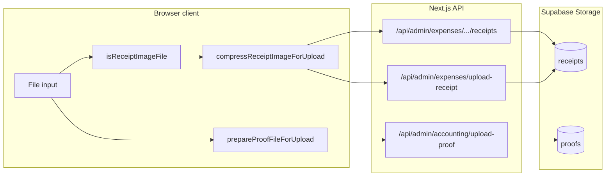

# Handoff: Admin receipt & proof image pipeline

Context for a parent agent or future session. This summarizes what was built for expense/accounting uploads and where to tune quality vs. size.

## Goal

- Upload **receipt photos** (Supabase bucket `receipts`) and **proof images** (bucket `proofs`) from admin, especially **iPhone**, without failures from huge files.
- Target file size roughly **~150 KB** for photos (similar to sending an image via Telegram from iPhone), to keep **Supabase free-tier storage** usage low while staying readable.

## Architecture

- **Receipts**: Client compresses (except when file is already ≤ cap), then `multipart/form-data` POST.
- **Proofs**: `prepareProofFileForUpload` — **images** use the same compressor/cap as receipts; **PDFs** pass through up to a larger limit (see limits file).

## Key files (edit these to improve results)

| File | Role |
|------|------|
| [`lib/receiptUploadLimits.ts`](../lib/receiptUploadLimits.ts) | **Single source of truth** for `MAX_RECEIPT_UPLOAD_BYTES` (~150 KB), proof image cap, PDF cap (`MAX_PROOF_PDF_BYTES`), `formatMaxFileErrorLabel()`. |
| [`lib/receiptImageCompress.ts`](../lib/receiptImageCompress.ts) | Canvas resize (max edge, min edge, scale step), JPEG quality ladder, HEIC path (`heic2any` fallback), `compressReceiptImageForUpload()`. **Primary place to tune readability vs. size.** |
| [`lib/isReceiptImageFile.ts`](../lib/isReceiptImageFile.ts) | Accepts images when **MIME is empty** (common on iOS) or extension matches. |
| [`lib/prepareProofFileForUpload.ts`](../lib/prepareProofFileForUpload.ts) | PDF vs image branching for `upload-proof`; calls compressor for non-PDF. |

### API enforcement (must stay aligned with client caps)

| File | Bucket / route |
|------|----------------|
| [`app/api/admin/expenses/[id]/receipts/route.ts`](../app/api/admin/expenses/[id]/receipts/route.ts) | `receipts` — POST size + MIME |
| [`app/api/admin/expenses/upload-receipt/route.ts`](../app/api/admin/expenses/upload-receipt/route.ts) | `receipts` — legacy/new expense flow |
| [`app/api/admin/accounting/upload-proof/route.ts`](../app/api/admin/accounting/upload-proof/route.ts) | `proofs` — **500 KB-class image cap** vs **larger PDF cap**; PDF detected by MIME or `.pdf` name |

### Client entry points (already wired to compressor / limits)

| File | Notes |
|------|------|
| [`app/admin/(dashboard)/expenses/[id]/ExpenseDetailClient.tsx`](../app/admin/(dashboard)/expenses/[id]/ExpenseDetailClient.tsx) | “Add image”, `compressingReceipt` / `uploadingReceipt` UX |
| [`app/admin/(dashboard)/expenses/new/NewExpenseForm.tsx`](../app/admin/(dashboard)/expenses/new/NewExpenseForm.tsx) | Receipt on create |
| [`app/admin/components/CostsAndProfitCard.tsx`](../app/admin/components/CostsAndProfitCard.tsx) | Flower + delivery receipt uploads |
| [`app/admin/(dashboard)/accounting/income/new/ManualIncomeForm.tsx`](../app/admin/(dashboard)/accounting/income/new/ManualIncomeForm.tsx) | Proof upload → `prepareProofFileForUpload` |
| [`app/admin/(dashboard)/accounting/AccountingShellClient.tsx`](../app/admin/(dashboard)/accounting/AccountingShellClient.tsx) | Transfer attachment → `prepareProofFileForUpload` |

### Build / deps

- [`package.json`](../package.json) — `heic2any` for HEIC decode when the browser cannot draw HEIC on canvas.
- [`next.config.js`](../next.config.js) — `transpilePackages` includes `heic2any`.

## Behaviors worth knowing

1. **Skip compression**: If `file.size <= maxBytes`, the **original file** is uploaded (no resize). To force downsizing for every photo, change logic in `compressReceiptImageForUpload` (currently early return).
2. **150 KB is aggressive**: May need lower JPEG quality or smaller `maxEdge` / extra edge steps in `receiptImageCompress.ts` if uploads fail or text is unreadable; **increase** cap in `receiptUploadLimits.ts` if quality is unacceptable.
3. **iOS**: `accept="image/*"` on file inputs; empty `file.type` handled via `isReceiptImageFile`.
4. **PDF proofs**: Not compressed client-side; only size-checked against `MAX_PROOF_PDF_BYTES`.

## Suggested improvements (not implemented here)

- **Binary-search JPEG quality** per canvas size instead of a fixed ladder (faster, tighter to cap).
- **Always apply max long-edge** (e.g. 1280px) even when file is under byte cap, for consistent resolution.
- **Server-side recompress** (e.g. Sharp) as a safety net — adds dependency and CPU cost on Vercel.
- **Telemetry**: log original vs. compressed size in dev to tune limits.

## Related storage (not this pipeline)

- **Vercel Blob**: custom order reference images (`lib/customOrder/uploadReferenceImage.ts`) — separate from receipts/proofs.
- **Sanity CDN**: storefront product images — unrelated.
