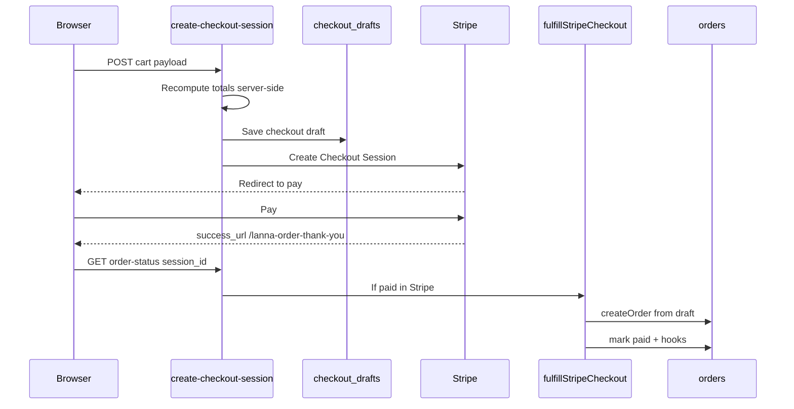

# Checkout, orders, and Stripe

How money and orders flow in production. **Source of truth is code**, not README.

## Order storage

- **Primary:** Supabase (`ORDERS_PRIMARY_STORE=supabase` when configured).
- Router: `lib/orders/router.ts` → `lib/orders/supabaseStore.ts`.
- Legacy Blob fallback only if `ORDERS_READ_FALLBACK=blob` (migration scenario).

## Cart checkout flow (create order after payment)

Key files:

| Step | File |
|------|------|
| Create session | `app/api/stripe/create-checkout-session/route.ts` |
| Draft storage | `lib/checkout/checkoutDrafts.ts` |
| Line items for Stripe | `lib/checkout/buildStripeCheckoutSessionBody.ts`, `lib/stripe/checkoutStripeLineItems.ts` |
| After payment | `lib/checkout/fulfillStripeCheckout.ts` — `fulfillPaidStripeCheckoutSession` |
| Webhook | `app/api/stripe/webhook/route.ts` |
| Poll / thank-you page | `app/api/stripe/order-status/route.ts`, `app/lanna-order-thank-you/`, `components/checkout/OrderThankYouClient.tsx` |
| Sync fallback | `app/api/stripe/sync-checkout-session/route.ts` |

**Invariant:** Cart flow logs *"checkout draft saved (order created after payment)"* — do **not** re-enable creating unpaid public orders from cart unless explicitly redesigned.

## Order-page flow (pay existing order)

- Unpaid order may exist first; customer pays via `create-checkout-session-for-order`.
- `fulfillPaidStripeCheckoutSession` marks existing order paid instead of creating from draft.

## Payment confirmation

Stripe is authoritative:

- `session.payment_status === 'paid'` OR PaymentIntent `succeeded`.
- Fulfillment triggers: `stripe_webhook`, `sync_checkout`, `order_status`.

After mark paid, `runStripePostPaymentSuccessHooks` (`lib/stripe/postStripePaymentSuccess.ts`) runs:

- Supabase payment sync
- Customer confirmation email
- Admin new-order notification
- GA4 `purchase` is browser-only via GTM (see analytics context)
- Income / accounting side effects

## Idempotency

- Webhook events deduped in `stripe_events`.
- `fulfillPaidStripeCheckoutSession` returns early if order already paid for session/token.
- Stripe session create uses idempotency keys (`lib/stripe/idempotency.ts`).
- `submission_token` on checkout pairs client + server (`lib/checkout/submissionToken.ts`).

## Public order access

- Each order has `public_token` in Supabase.
- Customer links: `/order/{orderId}?token=...` — token required for API and page data.
- `getOrderPublicToken`, `getOrderByIdWithPublicToken` in `lib/orders/`.

## Fulfillment vs payment status

- Stripe paths update **payment** fields only.
- **Fulfillment status** (preparing, dispatched, delivered, etc.) is admin-controlled and not overwritten by webhook.

## Admin delivery edits

- OWNER/MANAGER can edit delivery date, window, address, Maps URL, recipient, driver notes, and surprise flag via `PATCH /api/admin/orders/[order_id]/delivery-details`.
- Dual-writes normalized columns and `order_json.delivery` (including `preferredTimeSlot`) so customer order page, delivery board, and track-order lookup stay in sync.
- Does **not** change delivery fee or grand total.
- Blocked when `order_status` is `DELIVERED` or `CANCELLED`.
- Each edit is audited (`DELIVERY_DETAILS_UPDATE` in `audit_logs` with before/after). Admin order detail **Order history** merges status transitions and delivery diffs.
## Metadata

- Draft metadata on session: `checkout_draft_id`, `submission_token`, etc. (`lib/stripe/metadata.ts`).
- After order creation, order id backfilled to Stripe session/PaymentIntent/charge for reporting.

## Do not

- Trust client-sent `grandTotal`, `deliveryFee`, or discount amounts for Stripe line items.
- Expose full order JSON without `public_token`.
- Fire GA4 `purchase` from webhook as the primary path (browser + GTM is canonical — see [05_ANALYTICS_GTM_GA4_ADS.md](05_ANALYTICS_GTM_GA4_ADS.md)).

## Deep dive

- [docs/ORDERS_SUPABASE.md](../docs/ORDERS_SUPABASE.md)
- [docs/ORDERS_VERCEL.md](../docs/ORDERS_VERCEL.md) — env / deployment notes for order links
